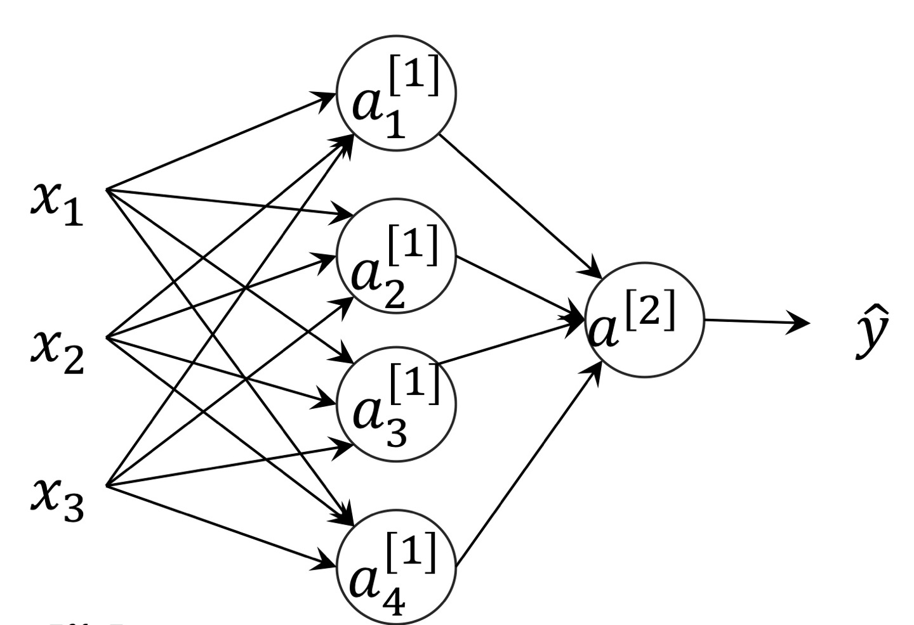

# Week 3 — Shallow Neural Networks
## 한 문장 요약
hidden layer(은닉층)가 추가된 shallow network를 구현하는 방법과 activation function의 종류에 대한 설명
## 배우지 않은 사람에게 설명한다면
### Shallow neural Network 정의
Shallow network는 딥러닝에 비해 현저히 작은 은닉층을 가지고 있는 뉴럴 네트워크를 의미한다.  

기존에는 입력 레이어와 출력 레이어로 구성된 네트워크를 다뤘지만, 이번 네트워크는 두 레이어 사이에 은닉층이 추가되어 결과를 분류할 때, 하나의 기준이 아닌 여러 기준을 통해 분리하도록 만든다.

즉, 더 복잡한 분류가 가능해지며, 하나의 직선으로 구분하기 어려웠던 데이터도 분류할 수 있게 되는 것이다.

hidden layer 내의 뉴런 개수가 늘어날수록 더 많은 기준을 이용하여 분류가 가능하다. 

다시 말해 각 뉴런은 z = w*x + b -> g(z) (이때 g는 activation function)의 계산을 수행하는데, 각 은닉층 뉴런마다 각 데이터를 분류하는 하나의 기준점이 된다. (ex. 숫자 이미지의 오른쪽 아래가 세로선인지 아닌지)

### Activation function
activation은 함수에 비선형성을 추가하기 위해 사용되는 함수이다.
대표적으로 sigmoid, tanh, ReLu가 있다.

tanh 함수는 sigmoid와 비슷하지만 range : -1<=y<=1을 나타내고 있기 때문에 중앙값이 0을 가리키고 있어 중앙값이 0.5인 sigmoid에 비해 학습 데이터를 학습 및 분류하는 데에 더 효과적이다.

ReLu는 max(0, z)로 표현되는 함수로 range는 0<=y로 표현된다.
미분값이 0이거나 1이기 때문에 z가 양수인 상황에서 기울기가 줄어들지 않아 파라미터 학습에 용이하다는 장점이 있다.