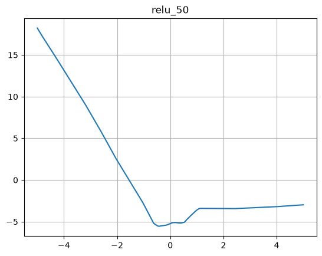
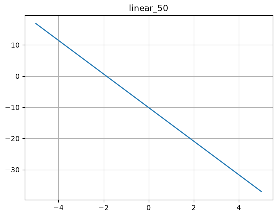

# 과제 0 — numpy 워밍업

## 문제 1 - 속도 비교

| 방법 | 소요 시간 | 배수 |
| --- | --- | --- |
| for_loop | 206.8932 ms (avg) | 566배 |
| dot_product | 0.3653 ms (avg) | 1배 |

### 결과 해석
10번의 시도 중 dot product 방법은 평균 0.36의 시간이 걸렸다.
이때, 첫 번째 시도 소요시간이 유난히 오래걸렸는데(0.8ms) 이는 추측하건대 첫 연산 과정에서 캐시 미스가 발생했다고 보고 있다.

추가로, 두 결괏값 사이에서 소수점 10자리부터 오차가 발생했는데 이는 부동소수점 표현의 한계로 인해 발생했다고 해석하고 있다.

## 문제 2 — 브로드캐스팅
### 코드 (print용 코드)
```
arr = np.random.randint(1, 10, size = (3, 4))
print(f"Original array : \n {arr}")

arr_sum = np.sum(arr, axis=0)
print(f"Sum of arr : {arr_sum}")

arr = arr / arr_sum
print(f"Array after division : \n {arr}")
```
### 코드 (한줄 코드)
```
arr = np.random.randint(1, 10, size = (3,4))
arr /= np.sum(arr, axis=0)
```
### 결과
``` text
Original array : 
 [[2 8 1 4]
 [7 2 7 6]
 [4 2 8 7]]

Sum of arr : [13 12 16 17]

Array after division : 
 [[0.15384615 0.66666667 0.0625     0.23529412]
 [0.53846154 0.16666667 0.4375     0.35294118]
 [0.30769231 0.16666667 0.5        0.41176471]]
```

## 문제 3 — rank-1 배열
### 결과
``` text
a shape : (5,)
b shape : (5, 1)

a.T shape : (5,)
b.T shape : (1, 5)

a dot product : 3.136765573078849
b dot product : [
[ 0.49721388 -0.14577609 -0.1438811   0.41110925  1 22726979]
 [-0.14577609  0.04273949  0.04218391 -0.12053143 -0.35981818]
 [-0.1438811   0.04218391  0.04163555 -0.1189646  -0.35514079]
 [ 0.41110925 -0.12053143 -0.1189646   0.33991573  1.0147383 ]
 [ 1.22726979 -0.35981818 -0.35514079  1.0147383   3.02926207]]
Original array : 
 [[2 8 1 4]
 [7 2 7 6]
 [4 2 8 7]]

Sum of arr : [13 12 16 17]

Array after division : 
 [[0.15384615 0.66666667 0.0625     0.23529412]
 [0.53846154 0.16666667 0.4375     0.35294118]
 [0.30769231 0.16666667 0.5        0.41176471]]
```

 ### 설명
 numpy의 rank는 선형대수학의 rank와 달리 축의 개수 즉, 차원을 나타내는 지표로 쓰인다.
 
 a array shape는 (5,)으로 1차원 배열이기 때문의 전치 변환(a.T)을 적용하더라도 데이터가 변화하지 않는다.
 
 반면, b array shape는 (5,1)으로 2차원 배열을 나타내기 때문에 전치 변환을 적용하면 (1,5)로 데이터가 변환된다.


 마지막 결과는 원본 행렬과 전치 행렬의 내적 결과를 나타낸다.
 
 a, a.T 사이의 dot product는 1차원 벡터의 내적을 나타낸다. 
 두 벡터의 같은 위치에 있는 값끼리 곱셈 연산을 적용하고 모두 더해 하나의 scalar 값을 도출한다. 
 
 b, b.t 사이의 dot product는 왼쪽 행렬의 col 개수와 오른쪽 행렬의 row 개수가 같아야하며 (ex. (5,3) dot (3,5) = (5,5)) 
 
 이때 계산은 b(왼쪽 행렬)의 i번째(1 <= i <= 3) 행과 b.T(오른쪽 행렬)의 i번째 행 간 내적을 적용한다.

 결론적으로 행렬의 명시적인 변환 및 연산을 위해서는 rank-2 배열을 사용하는 것이 유용함을 깨달았다.

## 문제 4 — ReLU로 곡선 만들기
- 꺾이는 위치를 나타내는 식:
z = wx + b라고 했을 때 z = 0이 되는 지점이 그래프가 꺾이는 지점이므로 x = -b/w가 꺾이는 지점을 의미함을 알 수 있다.


- 가설과 비교한 결론: 세웠던 가설과 비슷하게 꺾이는 지점이 촘촘하게 이어져 곡선 부분을 만들 수 있음을 확인할 수 있었다.


| ReLU 50개 | Linear 50개 |
|---|---|
|  |  |

## 막혔던 것 or 아직 모르겠는 것
이번 과제에서는 없었습니다.
