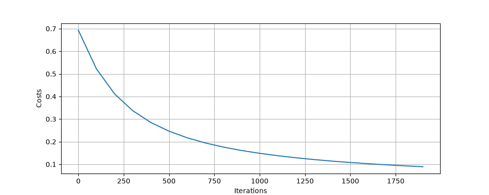
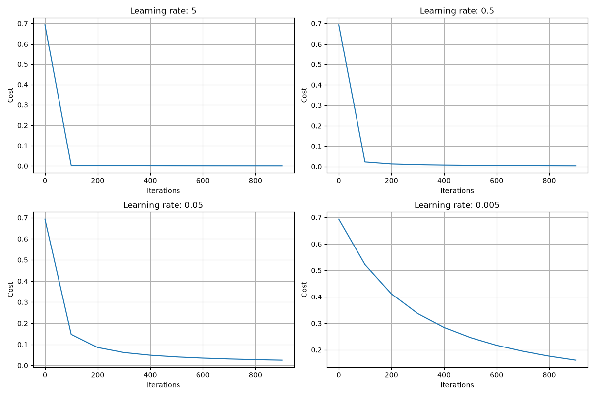
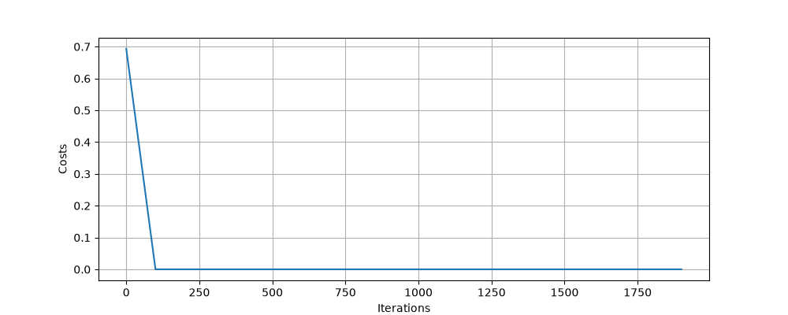
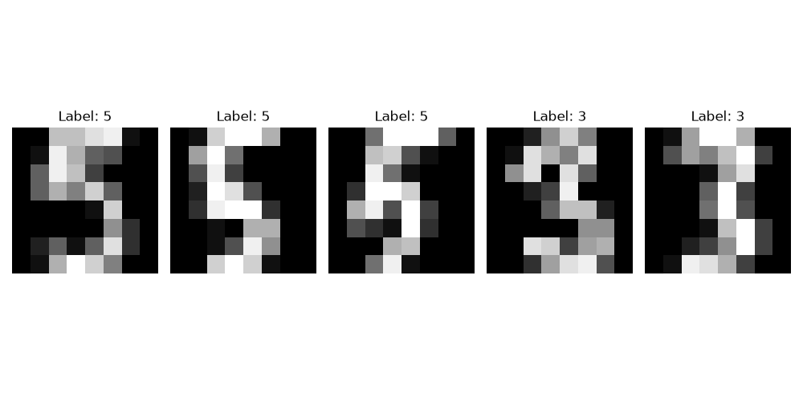

# 과제 1 — 로지스틱 회귀

## 구현 요약
손글씨 숫자(0 or 1)를 logistic regression을 사용하여, 학습 및 예측을 수행하는 모델 함수 및 수치적 방법을 이용하여 기울기를 검증하는 함수 구현

## 검증 결과 
> Iteration : 2000, Learning rate : 0.005에서 진행
- sigmoid 확인: 
  - sigmoid([-1000, 0, 1000]) = [0. , 0.5, 1. ]
- 기울기 검증 상대 오차: 1.0372745288e-09
- cost 곡선 
- 테스트 정확도 (0 or 1 손글씨)
  - Training 정확도: 100.0
  - Test 정확도: 100.0

## 실험 1 — 학습률 4종

첫 번째 그래프(왼쪽 위, learning rate = 5)는 cost가 급격하게 줄어드는 양상을 보입니다.

두 번째 그래프(오른쪽 위, learning rate = 0.5)는 첫 번째 그래프와 비슷한 양상을 보입니다.

세 번째 그래프(왼쪽 아래, learning rate =0.05)부터 기울기가 완만해지더니, 네 번째 그래프(오른쪽 아래, learning rate = 0.005)부터는 곡선 형태로 cost function의 값이 0에 수렴하는 것을 확인할 수 있었습니다.

해석 : linear regression은 learning rate를 크게 키웠을 때 부작용이 발생하기 때문에 적절한 learning rate를 찾는 것이 중요합니다.
무작정 큰 learning rate를 선택 할 경우, 가중치가 업데이트 되는 보폭은 증가하지만 최적 해 근처의 값에만 머물거나, 발산할 수 있기 때문입니다.

반면, 이번 실험(logistic regression)에서는 learning rate를 키우더라도 문제가 발생하지 않았습니다.

(아래는 learning rate : 5e11)



이번 실험에서는 learning rate를 극단적으로 크게 키우더라도 cost 함수는 0에 수렴하였는데, 이는 learning rate가 아주 크다면 sigmoid 값이 1 or 0 같은 극단값으로 선택이 되며 몇 번의 시도만으로 분류가 되었다고 해석하고 있습니다.

## 실험 2 — 3 vs 5 
| 문제 | train 정확도 | test 정확도 |
| --- | --- | --- |
| Train - Test 간 정확도 3.42%p 오차 발생 | 99.3150 | 95.8904|


## 실험 3 — 틀린 사례


실험 2,3의 경우 test가 training에 비해 낮은 정확도를 보이는데, 이는 training 과정에서 과적합이 일어났다고 볼 수 있습니다.

## 막혔던 것
### 증상 (Sigmoid 함수 scalar 처리 불가)
```
dl)  ahntaeju@AHNui-MacBookAir  ~/Desktop/project/dl-study/src/assignments/01-logistic-regression   main  python3 logistic_regression.py
Traceback (most recent call last):
  File "/Users/ahntaeju/Desktop/project/dl-study/src/assignments/01-logistic-regression/logistic_regression.py", line 191, in <module>
    main()
  File "/Users/ahntaeju/Desktop/project/dl-study/src/assignments/01-logistic-regression/logistic_regression.py", line 179, in main
    test = sigmoid([-1000, 0, 1000])
           ^^^^^^^^^^^^^^^^^^^^^^^^^
  File "/Users/ahntaeju/Desktop/project/dl-study/src/assignments/01-logistic-regression/logistic_regression.py", line 17, in sigmoid
    mask = z > 0
           ^^^^^
TypeError: '>' not supported between instances of 'list' and 'int'
```
### 원인 및 해결
함수 내에서 np.array에 대한 처리 알고리즘만 구현했기 때문에 sigmoid(scalar) 처리가 미흡했습니다.
이에, np.asarray를 추가하여 scalar 값을 변환한 뒤 처리하여 구현하였습니다.

---

### 증상 (a가 0일 때, np.log(a) -> NaN)
```
/Users/ahntaeju/Desktop/project/dl-study/src/assignments/01-logistic-regression/logistic_regression.py:66: RuntimeWarning: divide by zero encountered in log
  cost_equation = Y * np.log(a) + (1 - Y) * np.log(1 - a)
/Users/ahntaeju/Desktop/project/dl-study/src/assignments/01-logistic-regression/logistic_regression.py:66: RuntimeWarning: invalid value encountered in multiply
  cost_equation = Y * np.log(a) + (1 - Y) * np.log(1 - a)
```
### 원인
a or 1-a가 정확히 각각 0, 1일 경우 log(0)이 되어 NaN 결괏값이 도출되는 문제가 발생했습니다. 
### 해결
cost equation의 a는 sigmoid 함수를 통과한 값입니다. 이때 값이 무한히 작거나, 큰 경우 무한히 작거나 큰 수를 표현하는 대신 0과 1이 되어버립니다.

따라서, a값이 0에 도달하기 전의 값인 z를 사용하도록 만들었습니다.
```
(변경 전)
cost_equation = Y * np.log(a) + (1 - Y) * np.log(1 - a)
cost = -1/m * np.sum(cost_equation)

(변경 후)
cost = np.sum(np.logaddexp(0, (1 - 2 * Y) * z)) / m
```

위는 생성형 ai를 사용하여 해결하였습니다..
## 아직 모르겠는 것
- 초기 데이터를 pixel value를 최댓값이 1이 나오도록 만들었는데 이는 정규화 과정을 통해서 향후 학습에 용이하도록 만들었다고 판단됩니다.
- 실험 1에서 도출한 해석이 맞는 해석인지 잘 모르겠습니다.
## 확인할 내용

1. 손실 함수로 제곱 오차 대신 로그 손실을 쓰는 이유는 무엇인가.
- 제곱 오차로는 손실 업데이트가 어렵기 때문입니다.
예측이 틀렸을 경우, 기울기가 0에 가깝기 때문에 업데이트가 거의 되지 않습니다.
무엇보다 로그 손실을 사용하면 convex 함수로 cost function이 만들어지므로, local minimum에 빠질 위험이 없습니다.
2. `dw` 의 shape은 무엇이며 왜 그런가.
- (n, 1)입니다. w가 (n,1)이기 때문에 이를 업데이트 하기 위해 만들어진 편미분값 dw도 (n, 1)의 shape를 가집니다.
3. 학습률 5에서 무슨 일이 일어났는가.
- 다른 learning rate와 비교했을 때 더 빠른 속도로 cost가 0에 수렴하게 되었습니다.
4. 여기서는 `w` 를 0으로 초기화해도 문제가 없었다. 왜 괜찮은가.
- w를 0으로 초기화하더라도 모델은 propagate 및 optimize 과정을 통해 최적의 w 해를 찾아내기 때문에 가중치를 0이나 다른 값으로 설정하더라도 상관이 없다고 생각합니다. 무엇보다 초기 가중치를 0으로 초기화하면 시그모이드 함수 값은 0.5가 되기 때문에 가장 합리적인 초기 가중치라고도 생각됩니다.
5. 실험 2(숫자 3과 5 분류)에서 train 정확도와 test 정확도에 차이가 생겼다면, 그 차이는 무엇을 의미하는가.
- 과적합이 발생하여, training set'만' 잘 분류하도록 특화된 모델이 만들어졌음을 의미합니다.