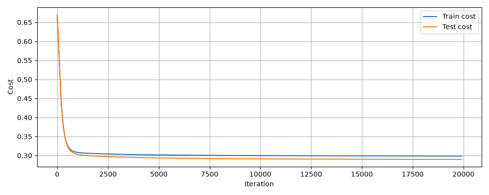
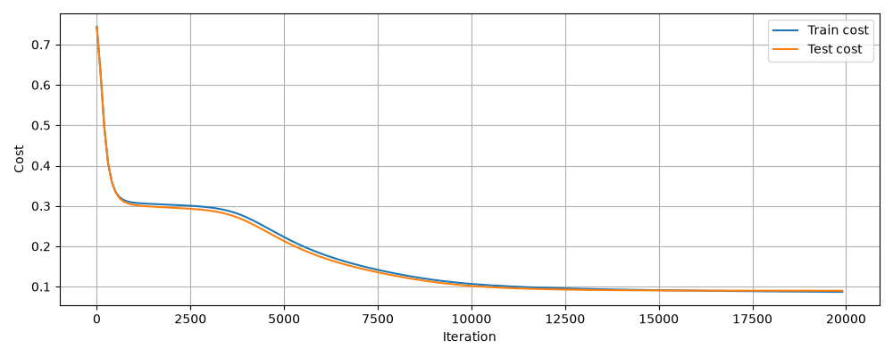
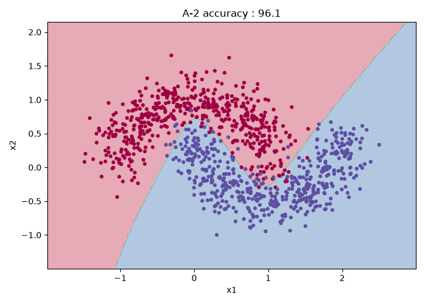
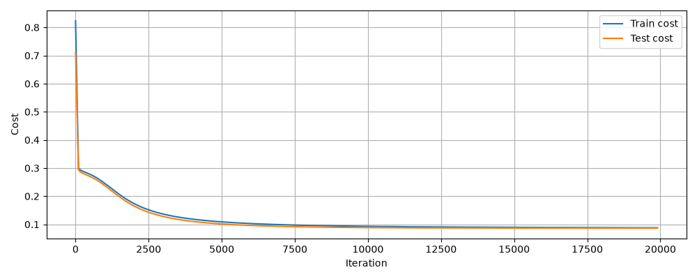
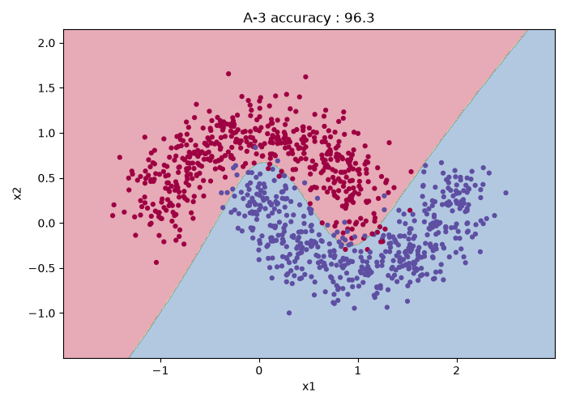
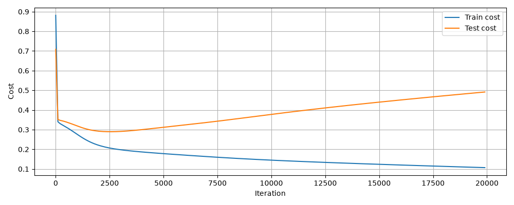
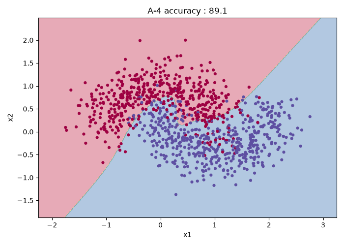
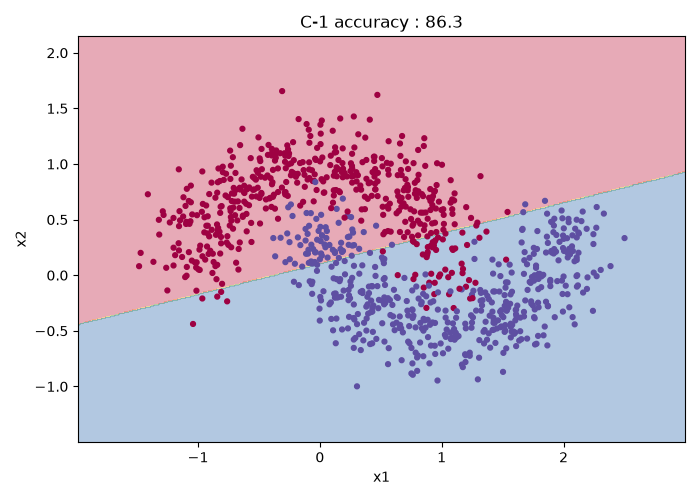

# 과제 2 — 2층 신경망

## 구현 요약
shallow network를 구현하여, 더욱 복잡한 분포를 가진 데이터를 분류하였습니다.
## 검증 결과
- 기울기 검증 상대 오차: 2.6512614213e-09
- n_h=4 시험 정확도:
  - Training accuracy: 96.00%
  - Test accuracy: 96.40%
- 결정 경계: 

## 2단계 — 로지스틱 회귀의 실패
- 정확도: 
    - Training accuracy: 87.25%
    - Test accuracy: 86.20%
- 결정 경계: 

## 실험 A — 세 가지 모양

| # | 설정 (은닉 유닛 / 학습 데이터 / noise) | 학습 정확도 | 시험 정확도 | 시험 비용이 최소가 되는 반복 횟수 | 모양 (잠정) |
| --- | --- | --- | --- | --- | --- |
| A-1 | 1개 / 400개 / 0.2 | 87.75% | 86.40% | 19900 | 과소적합 |
| A-2 | 4개 / 400개 / 0.2 | 96.50% | 96.10% | 19900 | 정상 |
| A-3 | 50개 / 400개 / 0.2 | 97.00% | 96.30% | 19900 | 정상 |
| A-4 | 50개 / 40개 / 0.3 | 95.00% | 89.10% | 2500 | 과적합 |

### A-1



### A-2



### A-3



### A-4




> 1.  A-2와 A-3을 비교하라. 은닉 유닛을 4개에서 50개로 **12배** 늘렸는데 결과가 어떻게 달라졌는가?  
거의 유사하다. 복잡한 분류 대상이 아니었기 때문에 4개의 은닉 유닛으로도 충분하게 학습이 가능했기 때문이다.  

>2.  A-3과 A-4를 비교하라. 모델은 똑같이 50개인데 왜 한쪽만 과적합이 되는가?  
충분한 training set가 주어지지 않았으며, noise도 더 많았기 때문이다.

> 3. 위 둘을 합치면 **"과적합은 무엇과 무엇의 관계에서 생기는가"** 에 답할 수 있다. 그 답을 한 문장으로 적어라.  
> training 데이터가 충분하게 제공되지 않거나 모델이 복잡한 경우 발생하며, 표본이 모집단을 제대로 반영하지 않은 경우에 편향이 생겨 test accuracy가 낮아진다.

## 실험 B — 0 초기화
| # | `W1` | `W2` | Train accuracy | Test Accuracy | n개의 서로다른 은닉 유닛
|---|---|---|---|---|---|
| B-1 | 0 | 0 | 50.00% | 50.00% | 1
| B-2 | 0 | 난수 | 91.25% | 91.90% | 50
| B-3 | 난수 | 난수 (원래 설정) | 97.00% | 96.30% | 50


### 생각해볼 것

> 1.  B-1에서 정확도가 왜 그 값이 되는가? 은닉 유닛을 50개가 아니라 500개로 늘리면 달라지는가?    
현재 모델의 정확도가 50이라는 것은 분류가 아닌 찍는 것과 다름 없는 상태임을 의미하며, 은닉 유닛의 수를 늘리더라도, 정확도에 영향을 줄 수 없다. 
모든 가중치가 0으로 초기화가 되어 있기 때문에 입력값이 더 많은 은닉 유닛을 거치더라도 초기 가중치가 변경되지 않는다.

>2.  B-1에서 `W1` 이 전혀 움직이지 않는다면, 역전파 식의 어느 항 때문인가? (힌트: `dZ1` 을 구할 때 `W2` 가 곱해진다)  
chain rule에 의해 dW1 = 1/m * np.dot(dZ1, X.T)를 계산해야하는데, 이때 $dZ1 = dZ2 * W2 * 1-(A^[1])^2$으로 표현되며 B-1에서 W2 가중치를 0으로 설정해두었기 때문에 W1 가중치 업데이트가 진행되지 않는다.

>3.  **B-2는 `W1` 이 0인데도 잘 동작한다.** 왜 그런가? B-1과 무엇이 다른가?
위에서 보았듯이, chain rule에 의해 dW1은 W2의 영향을 받게된다. 가중치 업데이트는 W1의 초기값에 관계없이 W2가 난수로 정상적으로 설정이 되어 있다면 W2는 0이 아니게 되어 학습이 일어나게 되어. 학습이 진행된다.


## 실험 C — 활성화 함수 제거
`forward_propagation` 에서 은닉층의 `tanh` 를 제거한다. 즉 `A1 = Z1` 로 둔다.

`n_h` 를 4개와 50개로 각각 돌리고, 정확도와 결정 경계를 기록한다. **2단계에서 구한 로지스틱 회귀의 결과와 비교**한다.

### C(n_h = 4)

- 정확도
    - Training accuracy: 87.75%
    - Test accuracy: 86.30%
### C(n_h = 50)

- 정확도
    - Training accuracy: 87.75%
    - Test accuracy: 86.30%

### 생각해볼 것

> 1.  은닉 유닛을 50개로 늘려도 결과가 달라지지 않는다. 왜인가?  
비선형성을 제거했기 때문에 은닉층이 아무리 추가되더라도 동일한 선형 연산의 연장에 불과하며, 따라서 은닉 유닛의 수가 늘어나더라도 결정 경계에 영향이 생기지 않는다.
> 2.  과제 0 문제 4의 5번에서 그린 그림과 어떻게 이어지는가?  
은닉층의 비선형성을 제거하면 수많은 연산이 존재하더라도 결국 하나의 선형 계산으로 귀결되기 때문에, 결국 로지스틱 회귀와 같은 형태가 된다.
> 3.  활성화 함수가 없는 2층 신경망은 결국 무엇과 같은가?  
두 층의 계산이 결국 하나의 선형 계산이 되고, output layer는 sigmoid로 구성되어 있기 때문에 logistic regression과 동일하다.

## 막혔던 것
- backpropagation 미분값을 구하는 데에 어려움을 겪었으나, 강의를 보고 여러번 식을 써보니 해결되었습니다.

### 실험 C - dZ1 미변경
```/Users/ahntaeju/Desktop/project/dl-study/src/assignments/02-shallow-nn/shallow-nn.py:288: RuntimeWarning: overflow encountered in multiply
  dZ1 = np.dot(W2.T, dZ2) * (1 - np.power(A1, 2))
/Users/ahntaeju/Desktop/project/dl-study/src/assignments/02-shallow-nn/shallow-nn.py:264: RuntimeWarning: invalid value encountered in logaddexp
  cost = np.sum(np.logaddexp(0, (1-2*Y)*Z2)) / m
C-2
Training accuracy: 50.00%
Test accuracy: 50.00%
```

### 문제
dZ1 = dZ2, W2의 dot product 그리고 tanh의 미분값으로 표현이 되는데, tanh를 더 이상 사용하지 않기 때문에 dZ1 식을 고쳐주어야했습니다.
### 해결
tahh의 미분값을 제거하여 해결하였습니다.

## 아직 모르겠는 것
- 아직 은닉 유닛의 이해도가 부족한 것 같습니다.  
    초기에 은닉층의 각 유닛은 tanh(w*x+b)을 나타내므로 은닉 유닛의 개수만큼 각기 다른 선을 나타낼 수 있고, 여러 분류 선이 존재한다고 생각했습니다. 
    
    위 가설대로라면 은닉층에 존재하는 선의 개수는 4개(n_h = 4)여야 마땅합니다만, 실제로는 하나의 선으로 분류가 진행되고 있습니다.    

    이를 바탕으로 잠정적으로 내린 결론은, 각 은닉 유닛은 특정 선을 나타내는 것이 아니라 각기 다른 질문 '-1.5 ~ 0 구간에서 왼쪽인가 오른쪽인가?' or 'x = 0~1 구간에서 데이터가 y=0.5 위에 존재하는가 아래에 존재하는가?' 등을 통해 데이터를 구분하고 있다고 생각하게 되었습니다. output layer에서 이를 조립하여 최종 곡선을 그린다고 이해하였습니다.

---

## 질문

1. 로지스틱 회귀로는 왜 이 데이터를 풀 수 없는가.  
단순한 선으로 데이터 분류가 불가능하기 때문입니다. 반면, 은닉 유닛이 늘어나면 데이터를 더 복잡한 기준으로 결정 경계를 나타낼 수 있습니다.

2. 은닉 유닛을 12배 늘렸는데 왜 과적합이 되지 않았는가.  
데이터가 단순한 편에 속하기 때문에, 은닉 유닛을 늘려도 과적합이 일어나지 않은 것으로 보여집니다.

3. 과적합인지 아닌지는 **무엇을 보고** 판단하는가.  
training cost는 지속적으로 감소하지만, test cost는 특정 지점부터 감소하지 않고, 증가한다면 과적합으로 판단됩니다.

4. 실험 B-1과 B-2의 차이는 무엇이며, 왜 한쪽만 동작하는가.
W1이 0일 때 B-1은 W2도 0, B-2는 W2가 0이 아닌 난수로 설정됩니다.
이때, dW1의 식은 W2에 영향을 받는데, W2가 0이면 dW1 = 0이 되어 학습이 일어나지 않지만, W2가 0이 아니면, 학습이 일어날 수 있기 때문에 W1이 0인지, 아닌지에 관계 없이 학습이 진행될 수 있었습니다.

5. 과제 1의 3 vs 5 곡선은 실험 A의 네 모양 중 어디에 해당했는가.  
당시 충분한 iteration을 제공하지 않았기 때문에 과소적합인 A-1과 비슷한 양상으로 예상됩니다.
